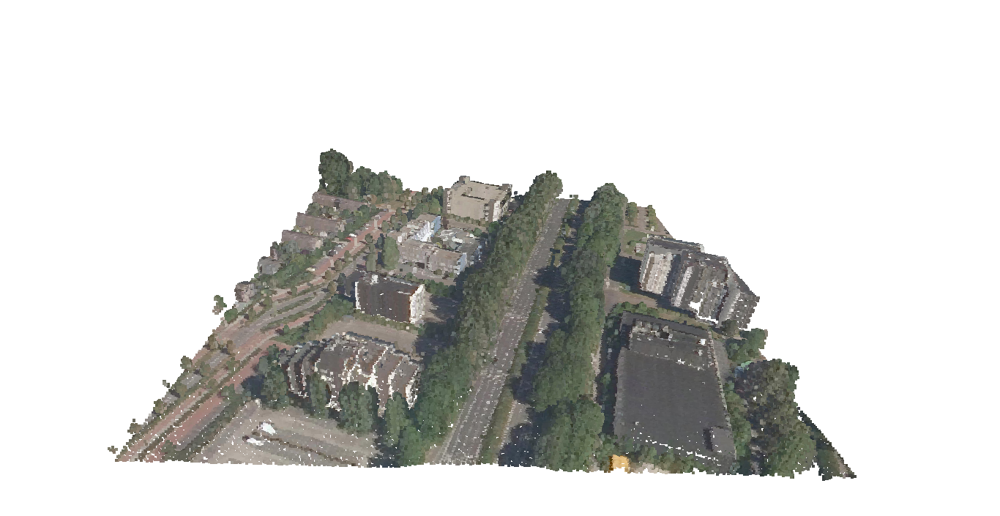
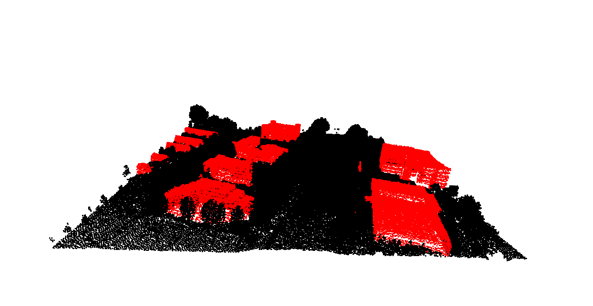
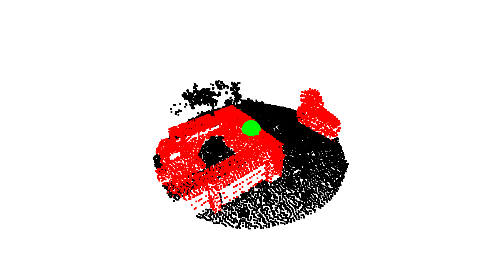
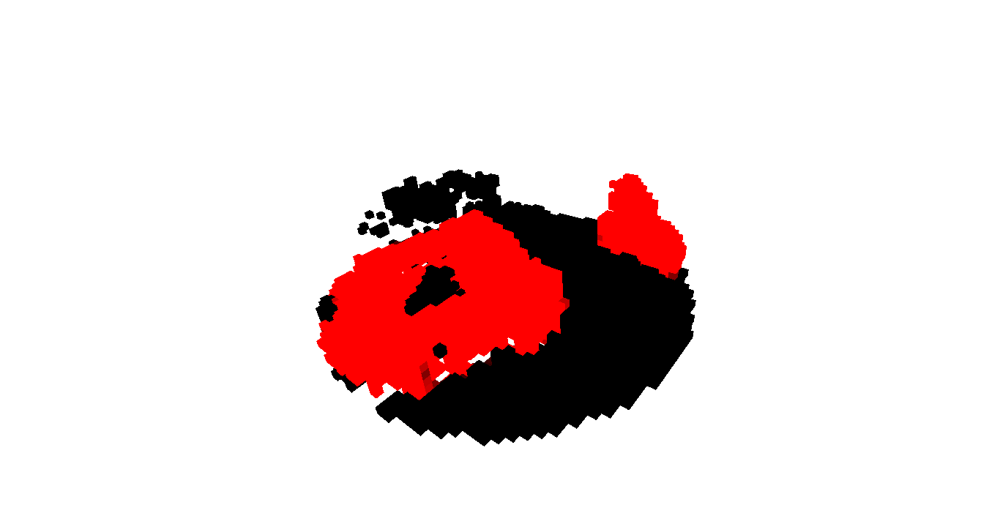
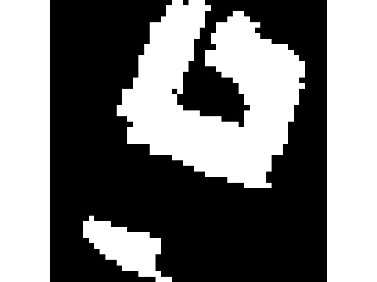

# LiDAR Building Footprint Extraction

Extract building footprints from a LiDAR point cloud using **Open3D**, **NumPy**, and **Pandas**. The project allows a user to interactively select a Point of Interest (POI), isolates a neighbourhood around that location, voxelizes the selected region, estimates building coverage, and generates a binary building footprint image.

---

## Preview

### Original Point Cloud
<p align="center">

</p>

### Buildings Highlighted
<p align="center">

</p>

### Selected Neighbourhood
<p align="center">

</p>

### Voxel Grid
<p align="center">

</p>

### Generated Building Footprint
<p align="center">

</p>

---

## Features

- Load and validate LiDAR point cloud data
- Downsample large datasets
- Interactive Point of Interest (POI) selection
- Highlight building points using classification labels
- Radius search using a KD-Tree
- Voxel grid generation
- Building footprint extraction
- Building coverage estimation
- Export filtered point cloud
- Save generated footprint image

---

## Project Structure

```
lidar-building-footprint-extraction/
│
├── data/
│   └── point_cloud.xyz
│
├── outputs/
│   └── README.md
│
├── assets/
│   ├── original_point_cloud.png
│   ├── building_highlight.png
│   ├── selected_neighbourhood.png
│   ├── voxel_grid.png
│   └── footprint.png
│
├── src/
│   └── main.py
│
├── config.yaml
├── requirements.txt
├── README.md
├── LICENSE
└── .gitignore
```

---

## Workflow

```
Load Point Cloud
        │
        ▼
Validate Dataset
        │
        ▼
Downsample
        │
        ▼
Convert to Open3D
        │
        ▼
Center Point Cloud
        │
        ▼
Select Point of Interest
        │
        ▼
Highlight Buildings
        │
        ▼
KD-Tree Radius Search
        │
        ▼
Extract Neighbourhood
        │
        ▼
Voxelization
        │
        ▼
Building Coverage Extraction
        │
        ▼
Generate Binary Footprint
        │
        ▼
Export Results
```

---

## Requirements

- Python 3.10+
- Open3D
- NumPy
- Pandas
- Matplotlib
- PyYAML

Install dependencies:

```bash
pip install -r requirements.txt
```

---

## Configuration

All project parameters are stored inside **config.yaml**.

Example:

```yaml
# Data
datasets:
  point_cloud: "data/point_cloud.xyz"

# Preprocessing
preprocessing:
  downsample_step: 2

# Point of Interest
poi:
  radius: 50

# Voxelization
voxel:
  size: 2

# Classification of Interest
classification:
  building: 6

# Output
output:
  filtered_point_cloud: "outputs/filtered_point_cloud.ply"
  footprint_image: "outputs/building_footprint.png"
```

---

## Usage

Run the project:

```bash
python src/main.py
```

---

## Selecting the Point of Interest

When the point cloud window opens:

- Hold **Shift**
- Left-click one point
- Press **Q** to confirm

The selected point becomes the centre of the neighbourhood used for footprint extraction.

---

## Outputs

The project generates:

### Filtered Point Cloud

```
outputs/filtered_point_cloud.ply
```

Contains only the selected neighbourhood.

### Building Footprint

```
outputs/building_footprint.png
```

Binary footprint image where:

- White = Building
- Black = Non-building

---

## Example Results

```
Coverage of Buildings : 3004 m²
Coverage of the Rest  : 4888 m²
Building Ratio        : 0.381
```

---

## How Building Coverage is Calculated

After voxelization:

1. Voxels are projected onto the XY plane.
2. For each XY location, only the highest voxel is retained.
3. Building voxels are identified using the LiDAR classification.
4. Coverage is computed as:

```
Building Area = Number of Building Cells × Voxel Area

Building Ratio =
Building Area /
(Building Area + Non-Building Area)
```

---

## Dataset Format

The input point cloud must contain the following columns:

| Column | Description |
|---------|-------------|
| X | X coordinate |
| Y | Y coordinate |
| Z | Elevation |
| R | Red value |
| G | Green value |
| B | Blue value |
| Classification | LiDAR classification |

---

## Future Improvements

- Automatic region selection
- Polygon footprint extraction
- Building boundary smoothing
- GeoTIFF export
- GIS integration
- Multiple POI selection
- Height map generation

---

## License

This project is licensed under the MIT License.

---

## References

This project was developed using publicly available datasets and educational resources. The following references were used throughout the implementation and for understanding LiDAR point cloud processing concepts:

1. **AHN4 LiDAR Dataset (GeoTiles)**
   - The point cloud used in this project is a **cropped sample of the 30HZ1_18 AHN4 tile** provided by GeoTiles.
   - Dataset source: https://geotiles.nl

2. **3D Python Workflows for LiDAR Point Clouds**
   - Several implementation ideas and Open3D workflow examples were adapted from the following article:
   - https://medium.com/data-science/3d-python-workflows-for-lidar-point-clouds-100ff40e4ff0

---

## Author

**Faisal Ajao**

Passionate about 3D Computer Vision, point cloud processing, and machine learning. Interested in building intelligent systems through spatial AI, 3D data intelligence, and 3D deep learning.
